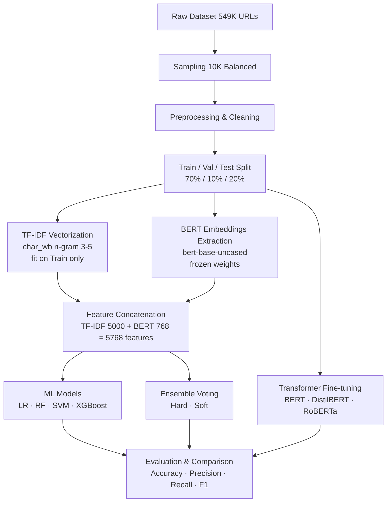

# 🛡️ Phishing Website Detection Using Contextual TF-IDF BERT Representation on URLs

End-to-end phishing website detection system combining **TF-IDF** and **BERT contextual embeddings** as feature representations, evaluated across **Machine Learning**, **Ensemble Learning**, and **Transformer Fine-tuning** models.

---

## 🚀 Project Overview

This project presents a comprehensive phishing URL detection system built as part of an undergraduate thesis research. The system leverages the power of **BERT (bert-base-uncased)** as a contextual feature extractor combined with **character-level TF-IDF** to create rich URL representations.

The workflow covers:
- URL Preprocessing & Cleaning
- Contextual Feature Extraction (TF-IDF + BERT Embeddings)
- Machine Learning Classification
- Ensemble Voting Methods
- Transformer Fine-tuning (BERT, DistilBERT, RoBERTa)
- Error Analysis & Cross-model Comparison

> **Key Contribution:** Demonstrating that TF-IDF + BERT feature representation can elevate classical ML models (especially SVM) to near-transformer-level performance, offering a computationally efficient alternative for phishing detection.

---

## 🎯 Research Objective

To build a phishing website detection model using **contextual TF-IDF BERT representation** on URLs and compare its effectiveness across multiple classification approaches:
- Classical Machine Learning
- Ensemble Learning
- Transformer-based Fine-tuning

---

## 🧠 Machine Learning Framing

| Component | Description |
|---|---|
| Problem Type | Supervised Learning |
| Task | Binary Classification |
| Target Variable | `Label` |
| Class 1 | Phishing (bad) |
| Class 0 | Legitimate (good) |
| Dataset Size | 10,000 URLs (balanced) |
| Split | 70% Train / 10% Val / 20% Test |

---

## 📊 Dataset Information

| Detail | Info |
|---|---|
| Source | Kaggle — Phishing Site URLs |
| Original Size | ~549,000 URLs |
| Sampled Size | 10,000 URLs (5,000 per class) |
| Features | Raw URL string |
| Labels | `bad` (phishing) / `good` (legitimate) |

Dataset Link: [Phishing Site URLs — Kaggle](https://www.kaggle.com/datasets/taruntiwarihp/phishing-site-urls)

---

## 🔬 Workflow Architecture



---

## 🛠️ Tech Stack

### Programming & ML
- Python 3.12
- PyTorch
- HuggingFace Transformers
- Scikit-learn
- XGBoost
- SciPy (Sparse Matrix)

### Visualization
- Matplotlib
- Seaborn

### Environment
- Google Colab (T4 GPU)
- Joblib (Model Persistence)

---

## 📈 Exploratory Data Analysis

Key findings from EDA:
- Dataset perfectly balanced after sampling (50% / 50%)
- Phishing URLs tend to be longer than legitimate URLs
- Common phishing patterns: IP addresses, excessive hyphens, suspicious keywords (`login`, `secure`, `verify`, `paypal`)
- Character-level n-grams effectively capture these patterns

---

## ⚙️ Feature Engineering

### TF-IDF (Character-level N-gram)
```python
TfidfVectorizer(
    analyzer='char_wb',
    ngram_range=(3, 5),
    max_features=5000,
    sublinear_tf=True
)
```
- **fit_transform** on training set only (no data leakage)
- **transform** on validation and test sets

### BERT Contextual Embeddings
```python
BertModel.from_pretrained('bert-base-uncased')
# Frozen weights — used as feature extractor only
# Output: [CLS] token embedding → 768 dimensions
```

### Final Feature Vector
```
TF-IDF (5,000) + BERT (768) = 5,768 features per URL
```

---

## 🤖 Models

### Machine Learning (with TF-IDF + BERT features)

| Model | Accuracy | Precision | Recall | F1 |
|---|---|---|---|---|
| Logistic Regression | 0.9330 | 0.9148 | 0.9550 | 0.9344 |
| Random Forest* | 0.8525 | 0.8243 | 0.8960 | 0.8586 |
| **SVM** | **0.9420** | **0.9333** | **0.9520** | **0.9426** |
| XGBoost | 0.9195 | 0.9030 | 0.9400 | 0.9211 |

*Random Forest tuned with `max_depth=6` to reduce overfitting (gap: 1.00 → 0.03)

### Ensemble Voting (LR + RF + SVM + XGBoost)

| Model | Accuracy | Precision | Recall | F1 |
|---|---|---|---|---|
| Hard Voting | 0.9295 | 0.9240 | 0.9360 | 0.9300 |
| Soft Voting | 0.9375 | 0.9219 | 0.9560 | 0.9386 |

### Transformer Fine-tuning

| Model | Accuracy | Precision | Recall | F1 | Error Rate |
|---|---|---|---|---|---|
| BERT base-uncased | 0.9430 | 0.9179 | 0.9730 | 0.9447 | 5.7% |
| DistilBERT | 0.9450 | 0.9304 | 0.9620 | 0.9459 | 5.5% |
| **RoBERTa** | **0.9580** | **0.9404** | **0.9780** | **0.9588** ⭐ | **4.2%** |

---

## 📌 Key Findings

### 1. Transformers Outperform Classical ML
All transformer models consistently outperformed classical ML and ensemble approaches, confirming the effectiveness of contextual representations for URL analysis.

### 2. RoBERTa is the Best Model
RoBERTa achieved the highest F1 score (0.9588) — consistent with the reference journal which also ranked roBERTa-base as the top transformer model.

### 3. SVM Nearly Matches BERT Fine-tuning
SVM with TF-IDF + BERT features (F1: 0.9426) nearly matched BERT fine-tuning (F1: 0.9447) with a margin of only **0.0021** — offering a lightweight alternative with significantly lower computational cost.

### 4. Ensemble Does Not Always Win
Ensemble Soft Voting (F1: 0.9386) underperformed SVM individual (F1: 0.9426) due to Random Forest's relatively weak performance pulling down the collective decision — a known **weak learner problem** in ensemble methods.

### 5. Gap with Reference Journal is Expected
~0.04 gap compared to the reference journal is justified by:
- Different dataset domain (URL vs Email)
- Shorter text length in URLs limits BERT's contextual advantage
- Smaller dataset size (10K vs larger email datasets)

---

## 🔗 Real-World URL Testing

Testing with 13 real-world URLs (5 legitimate, 5 phishing, 3 ambiguous):

| Category | Result |
|---|---|
| Legitimate URLs (5) | ✅ All correctly classified |
| Phishing URLs (5) | 🚨 All correctly detected (9/9 models agree) |
| Ambiguous URLs (3) | ⚠️ 2/3 correctly classified |

Notable observations:
- All phishing URLs with explicit patterns detected with **9/9 model consensus**
- URL shorteners (`bit.ly`) flagged as phishing — reasonable given common misuse
- Transformers more reliable than ML for very short URLs

---

## 📊 Comparison with Reference Journal

| Model | Our Results (URL) | Journal (Email) | Gap |
|---|---|---|---|
| BERT base-uncased | F1: 0.9447 | F1: 0.9922 | -0.0475 |
| DistilBERT | F1: 0.9459 | F1: 0.9911 | -0.0452 |
| RoBERTa | F1: 0.9588 | F1: 0.9951 | -0.0363 |

Reference: *Transformer-Based Machine Learning for Phishing Email Detection*

---

## 🔁 Experimental Setup

```
Dataset     : 10,000 URLs (balanced)
Split       : 70 / 10 / 20 (Train / Val / Test)
Epochs      : 3 (Transformer fine-tuning)
Batch Size  : 32
Learning Rate: 2e-5
Optimizer   : AdamW + Linear Warmup Scheduler
Max Length  : 128 tokens
Random Seed : 42 (reproducible)
```

---

## 🚀 Future Improvements

- [ ] Increase dataset size for better generalization
- [ ] Add URL content features (HTML, page title)
- [ ] Try ALBERT, XLNet for comparison
- [ ] Hyperparameter tuning with Optuna
- [ ] Model deployment via FastAPI or Streamlit
- [ ] Explainable AI with SHAP for feature importance
- [ ] Real-time phishing detection browser extension

---

## 📁 Repository Structure

```
phishing-detection-bert-tfidf/
│
├── notebooks/
│   └── phishing_detection.ipynb
│
├── models/
│   ├── bert_classifier.pt
│   ├── distilbert_classifier.pt
│   ├── roberta_classifier.pt
│   ├── logistic_regression.pkl
│   ├── svm.pkl
│   ├── xgboost.pkl
│   ├── random_forest_tuned.pkl
│   ├── ensemble_soft.pkl
│   └── tfidf_vectorizer.pkl
│
├── data/
│   └── df_clean.csv
│
├── images/
│   ├── distribusi_data.png
│   ├── confusion_matrix_final.png
│   ├── perbandingan_semua_model.png
│   ├── bert_learning_curve.png
│   ├── analisis_error_url.png
│   └── perbandingan_jurnal.png
│
└── README.md
```

---

## ▶️ How To Run

### 1. Clone Repository
```bash
git clone https://github.com/yourusername/phishing-detection-bert-tfidf.git
cd phishing-detection-bert-tfidf
```

### 2. Install Dependencies
```bash
pip install transformers torch scikit-learn xgboost pandas numpy matplotlib seaborn joblib scipy
```

### 3. Prepare Dataset
Download dataset from Kaggle and place in `data/` folder:
```
data/phishing_site_urls.csv
```

### 4. Run Notebook
Open and run sequentially:
```
notebooks/phishing_detection.ipynb
```

> ⚠️ GPU recommended for Transformer fine-tuning (Google Colab T4 GPU or better)

---

## 📚 References

- Devlin, J., et al. (2019). BERT: Pre-training of Deep Bidirectional Transformers for Language Understanding.
- Liu, Y., et al. (2019). RoBERTa: A Robustly Optimized BERT Pretraining Approach.
- Sanh, V., et al. (2019). DistilBERT, a distilled version of BERT.
- Phishing Site URLs Dataset — Kaggle

---

## 👨‍💻 Author

**Your Name**
- GitHub: [@yourusername](https://github.com/yourusername)
- Institution: [Your University]
- Thesis Title: *Phishing Website Detection Using Contextual TF-IDF BERT Representation on URLs*
